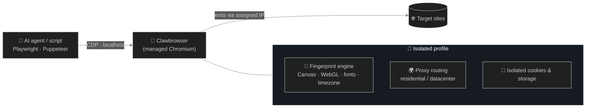

<p align="center">
  
</p>

<h1 align="center">🐾 Clawbrowser</h1>

<p align="center">
  <strong>The managed browser runtime for AI agents.</strong><br/>
  Every profile gets its own identity — unique fingerprint, real IP, isolated cookies — so your<br/>
  agents and scripts run further without hitting blocks, CAPTCHAs, or account bans.
</p>

<!-- Link buttons -->
<p align="center">
  <a href="https://clawbrowser.ai/"></a>
  <a href="https://clawbrowser.ai/docs/"></a>
  <a href="https://discord.gg/HCWx2aeXyq"></a>
</p>

<!-- Status badges -->
<p align="center">
  <a href="https://github.com/clawbrowser/clawbrowser/releases/latest"></a>
  <a href="https://github.com/clawbrowser/clawbrowser/blob/main/LICENSE"></a>
  <a href="https://github.com/clawbrowser/clawbrowser/stargazers"></a>
  
</p>

<!-- Stack: what it's built on + what it connects to -->
<p align="center">
  <sub><b>BUILT ON</b></sub><br/>
  
  
</p>
<p align="center">
  <sub><b>WORKS WITH</b></sub><br/>
  
  
  
  
  
</p>

---

## 🤔 Why Clawbrowser

Most browser automation fails not because the code is wrong — but because the browser **looks like a bot**. Anti-bot systems flag inconsistencies: a US IP with a German timezone, a headless flag in the user agent, a canvas fingerprint that never changes.

Clawbrowser is a Chromium build that manages the **identity layer** for you — fingerprint, proxy, and isolation are handled natively, then exposed over a standard **Chrome DevTools Protocol (CDP)** endpoint. Your Playwright / Puppeteer / agent code connects exactly as it would to any Chromium build; the identity work is transparent.

> ⭐ **If Clawbrowser saves your agents from getting blocked, give us a star** — it helps other builders find the project and shapes what we ship next.



<details>
<summary>📑 <b>Table of Contents</b></summary>

- [⚡ Quick Start](#-quick-start)
- [📦 Install](#-install)
- [Features](#features)
- [👥 Who it's for](#-who-its-for)
- [⚙️ How it works](#️-how-it-works)
- [🔌 Agent integration](#-agent-integration)
- [🖥️ CLI reference](#️-cli-reference)
- [📺 Remote viewing](#-remote-viewing)
- [🧬 Multi-profile management](#-multi-profile-management)
- [💻 Platform support](#-platform-support)
- [🛟 Troubleshooting](#-troubleshooting)
- [🤝 Contributing](#-contributing)
- [📄 License](#-license)

</details>

## ⚡ Quick Start

**Option 1 — let your AI agent install Clawbrowser.** Paste this prompt into your coding agent — Claude Code, Codex, Cursor, Gemini CLI, or any other:

```text
Install Clawbrowser and clawctl by following the official Clawbrowser install documentation.
Primary docs:
- https://raw.githubusercontent.com/clawbrowser/clawbrowser/main/INSTALL.md
- https://github.com/clawbrowser/clawbrowser
Instructions:
1. Read INSTALL.md first.
2. Follow the documented installation flow exactly.
3. Start from the standalone clawctl archive for the current OS/arch.
4. Do not download the browser archive manually as the bootstrap path.
5. Do not download the portable runtime manually unless INSTALL.md explicitly documents that as an offline/pre-extracted runtime path.
6. Do not use npm, npx, curl-piped installers, or a raw source checkout as the install path.
7. Run clawctl install so it can install or reuse Clawbrowser and install the portable runtime when needed.
8. Use the documented target/integration selection from INSTALL.md.
9. After installation, verify the browser using the verification steps documented in INSTALL.md.
API key:
- First check ${XDG_CONFIG_HOME:-$HOME/.config}/clawbrowser/config.json.
- If api_key already exists, do not ask again.
- If api_key is missing, ask once for the real API key from https://app.clawbrowser.ai.
- Save it using the documented clawctl config command.
- Never store the API key in shell rc files, environment variables, MCP config, agent config, project files, or logs.
Expected result:
- Standalone clawctl is installed and available.
- clawctl install has completed successfully.
- Clawbrowser is installed or reused.
- The portable Linux runtime is installed only when the host requires it.
- The selected agent integration is configured according to INSTALL.md.
- clawctl start works.
- Browser verification passes according to INSTALL.md.
```

**Option 2 — install yourself.** 🔑 First grab an API key at **[app.clawbrowser.ai](https://app.clawbrowser.ai)**, then:

```bash
clawctl install --json
clawctl config set --api-key "$CLAWBROWSER_API_KEY"
clawctl start --profile work --url https://example.com --json
clawctl endpoint --profile work --json
# → connect this CDP endpoint with Playwright / Puppeteer / your agent
```

See [Install](#-install) for the platform-specific commands to obtain `clawctl` itself.

## 📦 Install

`clawctl` is the bootstrapper: it installs (or reuses) Clawbrowser and the portable runtime, and wires the browser into your agent. The supported install path is the **standalone `clawctl` release archive** for your OS/arch — not `npm`, `npx`, curl-piped scripts, or a source checkout. Standalone archives live in the [`clawbrowser/clawctl`](https://github.com/clawbrowser/clawctl) repo ([latest release](https://github.com/clawbrowser/clawctl/releases/latest)); `clawctl install` then fetches the browser and portable runtime payloads from this repo when the host needs them.

> [!IMPORTANT]
> Don't extract `clawctl` under `/tmp` — many agent containers mount `/tmp` with `noexec` and `chmod +x` won't help. Use a durable, executable workdir.

<details open>
<summary><b>🐧 Linux</b> (server, container, no display required)</summary>

```bash
# Pick a durable workdir outside /tmp
mkdir -p ~/clawbrowser-install && cd ~/clawbrowser-install

# Download the standalone clawctl archive for your arch
archive="clawctl-linux-amd64.tar.gz"   # or clawctl-linux-arm64.tar.gz
url="https://github.com/clawbrowser/clawctl/releases/latest/download/${archive}"
curl -fL --retry 3 --retry-delay 2 -o "$archive" "$url"
tar -xzf "$archive"
cd clawctl-linux-amd64

./clawctl install --json
./clawctl config set --api-key "$CLAWBROWSER_API_KEY"
./clawctl start --profile work --url clawbrowser://verify/ --json
./clawctl verify --profile work --json
```

No Docker, sudo, apt, manual portable runtime download, or physical display is required.
</details>

<details>
<summary><b>🍎 macOS</b> (Apple Silicon)</summary>

```bash
archive="clawctl-macos-arm64.tar.gz"
url="https://github.com/clawbrowser/clawctl/releases/latest/download/${archive}"

curl -fL --retry 3 --retry-delay 2 -o "$archive" "$url"
tar -xzf "$archive"
cd clawctl-macos-arm64

./clawctl install --json
./clawctl config set --api-key "$CLAWBROWSER_API_KEY"
./clawctl start --profile work --url clawbrowser://verify/ --json
./clawctl verify --profile work --json
```

macOS uses `Clawbrowser.app` and requires a logged-in GUI desktop context (Xvfb is Linux-only).
</details>

<details>
<summary><b>🪟 Windows</b> (PowerShell, 64-bit)</summary>

```powershell
$archive = "clawctl-win-amd64.zip"
$url = "https://github.com/clawbrowser/clawctl/releases/latest/download/$archive"

Invoke-WebRequest -Uri $url -OutFile $archive
Expand-Archive -Force $archive .
Set-Location .\clawctl-win-amd64

.\clawctl.exe install --json
.\clawctl.exe config set --api-key "$env:CLAWBROWSER_API_KEY"
.\clawctl.exe start --profile work --url clawbrowser://verify/ --json
.\clawctl.exe verify --profile work --json
```

If the browser payload contains `setup.exe`, `clawctl install` runs it silently; Windows may prompt for administrator approval.
</details>

#### What `clawctl install` sets up

| | Component | Purpose |
| :--: | :--- | :--- |
| 🛠️ | **`clawctl` bootstrapper** | One CLI that installs, configures, updates, and starts the browser |
| 🐾 | **Clawbrowser browser payload** | Managed Chromium; downloaded automatically when no usable install exists |
| 🐧 | **Portable Linux runtime** | Bundled Xvfb, libs, xkb data and portable browser binary — fetched only when the host needs it |
| 🔌 | **Agent integrations** | Plugin / MCP / extension templates for Claude Code, Codex, Gemini CLI, Hermes and others, written into the locations each agent actually scans |

> 📖 Full archive list, durable-workdir guidance, and offline / pre-extracted runtime flows are in **[INSTALL.md](./INSTALL.md)**.

## Features

| | Feature | What it does |
| :--: | :--- | :--- |
| 🪪 | **Realistic fingerprints** | Each profile gets a unique, internally consistent fingerprint across the surfaces sites use to tell humans from bots — Canvas, WebGL, AudioContext, `navigator.*`, screen, fonts, timezone, locale, plugins, media devices, WebRTC. |
| 🌍 | **Browse from any location** | Attach a residential or datacenter IP to a profile; traffic exits from the country you choose. |
| 🫧 | **Isolated profiles** | Every profile is a sealed bubble — its own cookies, storage, and identity. No cross-contamination between accounts. |
| 🔌 | **Works with your tools** | Standard CDP endpoint — Playwright, Puppeteer, Claude Code, and other CDP clients connect as-is, no code changes. |
| 📺 | **Live remote view** | One command turns any profile into a watchable, controllable browser session over a shareable `viewer_url`. |
| ⚡ | **One command to start** | Launch a session with a single command and get back a URL your agent connects to. |

## 👥 Who it's for

<table>
<tr>
<td width="50%" valign="top">

#### 🤖 AI developers
Give your agent a browser that works like a real person's, so it focuses on the task instead of CAPTCHA walls mid-run.

</td>
<td width="50%" valign="top">

#### 📈 Growth & marketing
Manage many accounts, each in a fully isolated profile that looks like an independent user.

</td>
</tr>
<tr>
<td width="50%" valign="top">

#### 🔬 Data & research teams
Run parallel scraping/monitoring jobs and keep each profile's identity consistent across runs.

</td>
<td width="50%" valign="top">

#### 🛠️ SaaS builders
Ship browser-automation features without building the identity stack yourself; plugs into any Playwright/Puppeteer setup.

</td>
</tr>
</table>

## ⚙️ How it works

```mermaid
%%{init: {'theme':'dark', 'themeVariables': {'background':'#0d1117','primaryColor':'#161b22','primaryTextColor':'#e6edf3','primaryBorderColor':'#30363d','lineColor':'#7d8590'}}}%%
flowchart LR
    Install["clawctl install"] --> Key["clawctl config set --api-key"]
    Key --> Start["clawctl start --profile work"]
    Start --> Profile["Generate / reuse profile<br/>🪪 fingerprint + 🌍 proxy"]
    Profile --> Boot["Managed Chromium boots<br/>consistent identity"]
    Boot --> Endpoint["clawctl endpoint --profile work<br/>→ CDP URL"]
    Endpoint --> Agent["🤖 Your agent connects<br/>Playwright / Puppeteer"]
```



1. **Install once.** `clawctl install` pulls Clawbrowser, the portable Linux runtime (when the host needs it), and the integration templates for the agents on the box.
2. **Save your API key.** `clawctl config set --api-key …` writes it to `~/.config/clawbrowser/config.json`. `clawctl install` and `clawctl start` use it automatically from then on.
3. **Start the browser.** `clawctl start --profile <name>` boots a managed Chromium with a generated or reused profile and prints a local CDP endpoint when it's ready.
4. **Identity stays consistent.** The same profile propagates into the renderer and GPU processes at startup, so user agent, platform, fonts, timezone, locale, screen, and proxy geo all line up.
5. **Your agent connects over CDP.** Fingerprint patching and proxy routing are invisible to the automation client — re-fetch the endpoint with `clawctl endpoint` after any restart or failure; don't cache it.

> 🔎 Verify any profile against the built-in proof page at **`clawbrowser://verify/`** to inspect proxy egress and the generated fingerprint surfaces:
> ```bash
> clawctl start --profile work --url clawbrowser://verify/ --json
> clawctl verify --profile work --json
> ```

## 🔌 Agent integration

Connect your framework to the endpoint from `clawctl endpoint --profile <name> --json`.

<details open>
<summary><b>🐍 Playwright (Python)</b></summary>

```python
from playwright.async_api import async_playwright

async with async_playwright() as p:
    endpoint = "http://127.0.0.1:9222"  # from: clawctl endpoint --profile work --json
    browser = await p.chromium.connect_over_cdp(endpoint)
    page = browser.contexts[0].pages[0]
    await page.goto("https://example.com")
    content = await page.content()
```
</details>

<details>
<summary><b>🟢 Playwright (Node.js)</b></summary>

```js
const { chromium } = require('playwright');

const endpoint = 'http://127.0.0.1:9222'; // from: clawctl endpoint --profile work --json
const browser = await chromium.connectOverCDP(endpoint);
const page = browser.contexts()[0].pages()[0];
await page.goto('https://example.com');
```
</details>

<details>
<summary><b>🎭 Puppeteer</b></summary>

```js
const puppeteer = require('puppeteer');

const endpoint = 'http://127.0.0.1:9222'; // from: clawctl endpoint --profile work --json
const browser = await puppeteer.connect({ browserURL: endpoint });
const [page] = await browser.pages();
await page.goto('https://example.com');
```
</details>

> [!TIP]
> Don't override fingerprint properties via CDP. Clawbrowser handles overrides at the engine level; CDP-level overrides can conflict and create detectable inconsistencies.

## 🖥️ CLI reference

```bash
# Install / reuse the browser and the portable runtime when needed
clawctl install --json

# Save your API key (persisted to ~/.config/clawbrowser/config.json)
clawctl config set --api-key "$CLAWBROWSER_API_KEY"

# Start (or reattach to) a managed session, optionally opening a URL
clawctl start --profile work --url https://example.com --json

# Print the live CDP endpoint (always re-fetch after start / restart / failure)
clawctl endpoint --profile work --json

# Verify proxy egress + fingerprint surfaces against the built-in proof page
clawctl verify --profile work --json

# Check remaining proxy traffic on the account
clawctl proxy-traffic --json

# Open another URL on the running profile
clawctl open --profile work https://example.com --json

# Update clawctl and the browser/runtime to the latest releases
clawctl update

# Sidecar mode: drive an already-running CDP session
clawctl --cdp http://127.0.0.1:9222 tabs list --json
clawctl --cdp http://127.0.0.1:9222 verify --json
```

> [!IMPORTANT]
> **API key.** Get one at [app.clawbrowser.ai](https://app.clawbrowser.ai). Save it with `clawctl config set --api-key …` — that writes it to `${XDG_CONFIG_HOME:-$HOME/.config}/clawbrowser/config.json` and every subsequent `clawctl` call picks it up. Never store the key in shell rc files, env files, MCP/agent config, project files, or logs.

## 📺 Remote viewing

Need to watch your agent work, hand a stuck flow over to a human, or stream a session into a UI? Open the target URL on a profile, then start a remote session:

```bash
clawctl open --profile work https://example.com --json
clawctl remote --profile work --wait=false --json
```

Share only the returned `viewer_url` — treat it as a sensitive, temporary control link. If multiple tabs are open, narrow the target with `--target-url-contains` or `--target-title-contains`.

## 🧬 Multi-profile management

Every named profile is a fully isolated browser session with its own fingerprint, proxy, cookies, and CDP endpoint. Use distinct names per agent / account / region:

```bash
clawctl start --profile agent-us --url https://example.com --json
clawctl start --profile agent-de --url https://example.com --json
clawctl start --profile agent-uk --url https://example.com --json

# Pull endpoints separately
clawctl endpoint --profile agent-us --json
clawctl endpoint --profile agent-de --json
clawctl endpoint --profile agent-uk --json
```

- ♻️ **Profile names are sticky** — reusing a name reuses the cached identity (cookies, fingerprint, proxy binding).
- 🏷️ Use descriptive names like `agent-us`, `de-scraper-main`, or `growth-account-04`.

## 💻 Platform support

| | Platform | Mode | Notes |
| :--: | :--- | :--- | :--- |
| 🍎 | **macOS** | Native desktop app | Uses `Clawbrowser.app`; requires a logged-in GUI desktop. Apple Silicon (`arm64`). |
| 🐧 | **Linux** | Portable runtime | Default on Linux servers, no-display hosts, and restricted containers. Bundles Xvfb, libs, and xkb data — no Docker required. glibc (`amd64` / `arm64`). |
| 🪟 | **Windows** | Native install | 64-bit Windows via PowerShell. May surface a UAC prompt during install when `setup.exe` is present. |

## 🛟 Troubleshooting

| Symptom | Likely cause | Fix |
| :--- | :--- | :--- |
| `clawctl: command not found` | Standalone archive not extracted, or extract dir not on `PATH`. | Run `./clawctl …` from the unpacked archive, or add the install bin dir to `PATH`. |
| `Permission denied` after `chmod +x` | Extracted under `/tmp` or another `noexec` filesystem. | Re-extract into a durable executable workdir (e.g. `~/clawbrowser-install` or a workspace mount), then rerun. |
| API key prompts every time | Key wasn't saved via `clawctl config set`. | Run `clawctl config set --api-key "$CLAWBROWSER_API_KEY"` once; future calls pick it up from `~/.config/clawbrowser/config.json`. |
| `Timed out waiting for CDP on port …` | Browser startup failed or is slow. | Retry; inspect startup logs; for already-running sessions use `--cdp <url>` sidecar mode. |
| `invalid API key` / API unreachable | Wrong key or network/backend issue. | Re-check the key from app.clawbrowser.ai and your egress connectivity. |
| Endpoint refused or stale | Profile restarted or endpoint changed. | Re-run `clawctl endpoint --profile <name> --json` after every start/restart/failure; never persist the endpoint in config. |
| `proxy-traffic` reports `state: "exhausted"` | Account proxy quota used up. | Top up traffic in the dashboard and rerun; pause proxy-backed runs until then. |

## 🤝 Contributing

<!-- If you accept PRs, add a CONTRIBUTING.md (dev setup, PR conventions, DCO/CLA)
     and link it here. If the repo is release-only, state that instead. -->
Contributions, issues, and feature requests are welcome. Please open an issue to discuss substantial changes first. See `CONTRIBUTING.md` for development setup and guidelines.

## 📄 License

Distributed under the **MIT** license. See [`LICENSE`](./LICENSE) for details.

---

<p align="center">
  <sub>🐾 © 2026 Clawbrowser. Available on macOS, Linux, and Windows.</sub>
</p>
